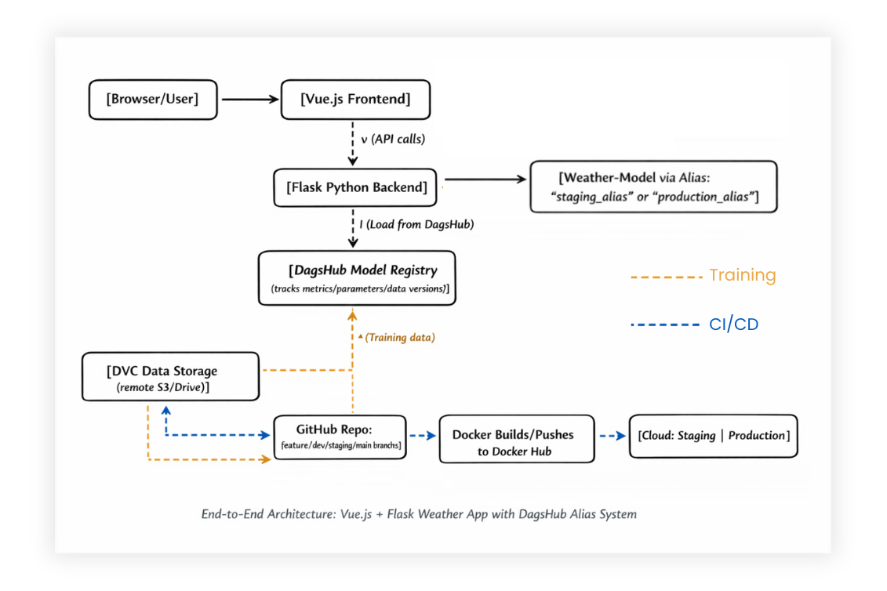

# Weather Model MLOps Project

Web application that serves a weather prediction model with a Vue.js frontend and a Python Flask backend, connected to a model registry and automated pipelines.

## Architecture Diagram

- Vue.js frontend sends requests to the Flask backend.
- Flask backend loads the current model version from the registry (DagsHub) using environment-specific aliases.
- Training data is versioned with a data versioning tool and stored remotely.
- Git hooks:
  - `pre-commit`: clean Python code.
  - `pre-push`: train the model and log it to DagsHub.
- Containers are built and deployed to staging and production environments on the cloud.

## CI/CD Explanation

- **Pull request → `dev` branch**  
  - Run unit tests and integration tests.  
  - Build images using the staging configuration.

- **Pull request → `staging` branch**  
  - Run a full test suite.  
  - Update the model alias for the staging environment.  
  - Build and push staging images (backend and frontend) to the container registry.

- **Pull request → `main` branch**  
  - Evaluate the candidate model with a quality gate - Mean absolute error of at least 25000.  
  - If it passes, promote the model to production.  
  - Build and push production images.

 ## Model Promotion Explanation

- Training scripts log each new model version to the registry with:
  - Metrics,
  - Hyperparameters,
  - Data version identifier,
  - Source code commit identifier.
- A tagging script assigns aliases such as `development` and `staging` to model versions.
- A promotion script:
  - Reads the metrics of the candidate model,
  - Checks the quality threshold,
  - Updates the `production` alias only if the model passes the gate.

## Reproducibility Instructions

1. Clone the repository and install backend and frontend dependencies.
2. Checkout the commit you want to reproduce.
3. Pull the matching data version with the data versioning tool.
4. Run the training script to retrain and log the model.
5. Start the application:
   - Locally with Docker Compose using the staging or production configuration, **or**
   - By opening pull requests to trigger the automated pipelines.
